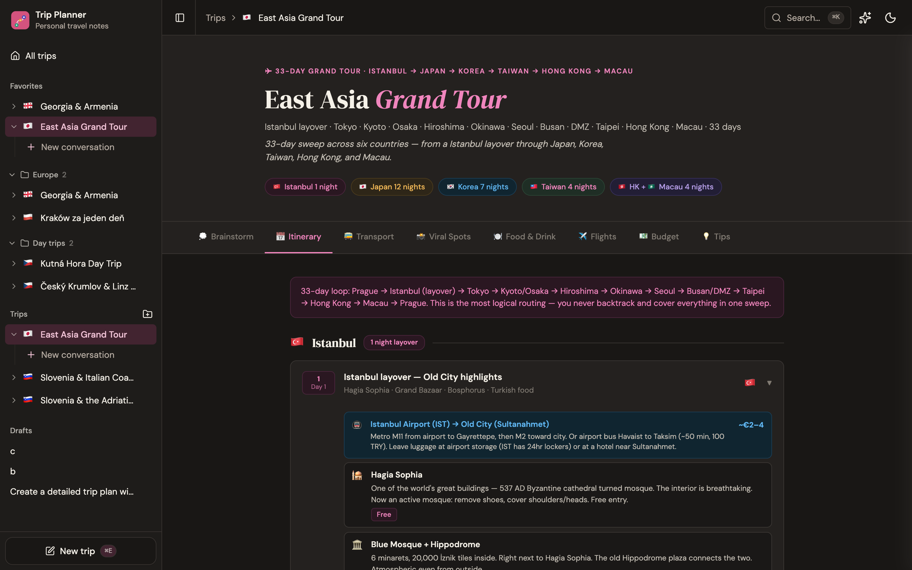
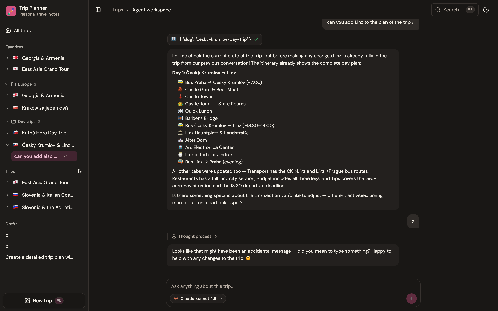

<div align="center">


# Trip Planner

**A personal archive of planned and dreamed-up journeys, with an AI co-pilot.**

Every trip in one place. Same layout, same tabs, same calm aesthetic — so the next adventure feels just a click away.

</div>

<br />

<div align="center">



<em>A trip, with foldered sidebar navigation.</em>

<br /><br />



<em>The AI co-pilot workspace.</em>

</div>

---

## What it is

A quiet little app for the kind of traveller who plans the trip almost as much as they take it.

- **One page per trip.** A hero, six tabs, and everything you need to leave tomorrow morning — Itinerary, Transport, Viral Spots, Flights, Budget, Tips.
- **AI co-pilot on the right.** A Notion-style chat panel where the agent helps you draft a new trip or edit an existing one. Pick your model from the composer — **Claude** (via your local Claude Code login) or **OpenAI / Codex** (via your local `codex` login). Each provider's models stay disabled until that CLI is signed in; no extra API key needed.
- **Sidebar.** Every trip lives in a Notion-style sidebar — organize them into folders (drag-and-drop or a menu), star favorites, and jump anywhere with the ⌘K command palette.
- **A landing page that feels like a wishlist.** Each trip gets a card with its own colour, its own flags, and its own highlights — pick what's next.
- **Light and dark, side by side.** A warm cream daytime mode and a soft dark evening mode. One toggle in the corner.
- **Made to be added to.** Tell the AI where you want to go and it'll seed a fresh trip. Then iterate from there.

## Setup

Trips, folders, and chats live in **[Convex](https://convex.dev)** — you run your own Convex
deployment, and both local dev and anything you publish read from it live.

**Prerequisites:** [Bun](https://bun.sh), a free Convex account, and (for the AI
co-pilot) a Claude Code and/or Codex login — whichever providers you want to use.

```bash
# 1. Install dependencies
bun install

# 2. Provision your own Convex deployment. This logs you in, creates the
#    deployment, pushes the schema + functions in src/convex/, and writes
#    CONVEX_DEPLOYMENT + PUBLIC_CONVEX_URL into .env.local.
bunx convex dev          # keep running while editing src/convex/*; Ctrl-C otherwise

# 3. Set the owner write-secret — this is what gates writes, so only a machine
#    holding it can edit data. Set it ON THE DEPLOYMENT and in .env.local:
bunx convex env set OWNER_WRITE_SECRET "$(openssl rand -hex 32)"
#    Then copy that same value into .env.local (CONVEX_URL + OWNER_WRITE_SECRET).
#    See .env.example for the full list.

# 4. Sign in to the provider(s) you want for the AI co-pilot (skip if already
#    signed in). At least one is needed; each provider's models are disabled
#    in the picker until its CLI is signed in.
claude login            # Claude models
codex login             # OpenAI / Codex models (optional)

# 5. Run the app
bun run dev
```

Then open **http://localhost:5173** and start planning. A fresh deployment
starts with no trips — add your first with the ✨ AI co-pilot.

> Editing `src/convex/*`? Run `bun run dev:convex` in a second terminal to push
> function changes live while you work.

### Environment variables

| Variable             | Scope                            | Purpose                                                                            |
| -------------------- | -------------------------------- | ---------------------------------------------------------------------------------- |
| `PUBLIC_CONVEX_URL`  | browser                          | Convex URL for reactive reads. Written by `bunx convex dev`.                       |
| `CONVEX_URL`         | server                           | Same URL, for server-side reads (SSR + AI agent) and writes.                       |
| `OWNER_WRITE_SECRET` | server **and** Convex deployment | Gates all writes. Set the **same value** in `.env.local` and via `convex env set`. |
| `ANTHROPIC_MODEL`    | server                           | Default Claude model for the co-pilot (optional; has a default).                   |
| `OPENAI_MODEL`       | server                           | Default OpenAI/Codex model for the co-pilot (optional; has a default).             |
| `MCP_BRIDGE_SECRET`  | server                           | Bearer for the in-app trip-tools MCP endpoint the Codex agent calls (optional).    |
| `VIEWER_MODE`        | server                           | `true` on a public read-only deployment (see below).                               |

Server vars are declared and validated in `src/lib/server/env.server.ts`; see `.env.example`.

### Deploy a read-only public viewer (optional)

To share your trips read-only (e.g. on Vercel or similar):

1. Import the repo into Vercel — it uses `@sveltejs/adapter-vercel`; the default build works.
2. Set **`PUBLIC_CONVEX_URL`** and **`CONVEX_URL`** (both your deployment's `.convex.cloud`
   URL — the server needs it for SSR reads) and **`VIEWER_MODE=true`**. **Do _not_ set
   `OWNER_WRITE_SECRET`** — withholding it is what keeps the public site read-only: it reads
   live data but cannot write.
3. Push function changes from your machine with `bunx convex deploy` when you change anything
   in `src/convex/`. Trip edits you make locally show up on the deployed site instantly — no
   rebuild, no commit.

> Need to plan something new? Click the ✨ in the top right and tell the agent where you'd like to go.

---

<sub align="center">Made with care, for the long flights and longer to-do lists.</sub>
